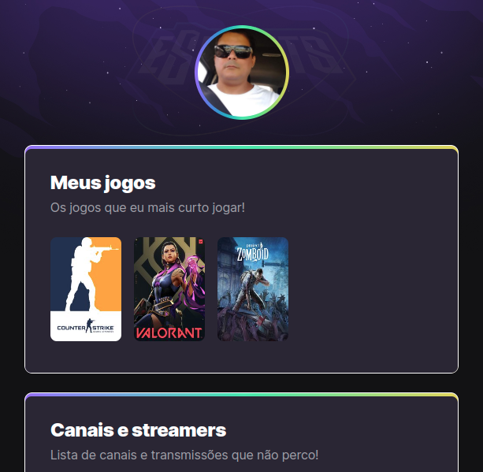

# projeto-NLW-eSports-rocketseat

projeto construido no evento Next Week da rocketseat.
Bem-vindo ao projeto NLW Esports! Este é um simples site HTML que apresenta informações sobre jogos favoritos, canais de transmissão e redes sociais do criador, Petrucci. Este README fornecerá uma visão geral do projeto e como você pode executá-lo localmente.

Conteúdo
Visão Geral
Instruções de Uso
Contribuição
Licença
Visão Geral
O projeto NLW Esports é um site estático simples criado em HTML. Ele apresenta três seções principais:

Meus jogos: Uma lista de jogos favoritos do criador, cada um deles é vinculado à sua respectiva página no Twitch para que os visitantes possam assistir a transmissões ao vivo.

Canais e streamers: Uma lista de canais e streamers que o criador acompanha, com links diretos para suas páginas no Twitch.

Minhas redes: Links para as redes sociais do criador, permitindo que os visitantes se conectem com ele.

Instruções de Uso
Para executar este projeto localmente, siga estas etapas simples:

Clone este repositório em seu ambiente de desenvolvimento:

bash
Copy code
git clone https://github.com/seu-usuario/nlw-esports.git
Navegue até o diretório do projeto:

bash
Copy code
cd nlw-esports
Abra o arquivo index.html em seu navegador da web preferido para visualizar o site.

bash
Copy code
open index.html
Agora você pode explorar o site e suas funcionalidades no seu ambiente local.

Contribuição
Se você gostaria de contribuir para este projeto, sinta-se à vontade para abrir problemas (issues) ou enviar solicitações de pull (pull requests) para correções, melhorias ou adições.

Licença
Este projeto é licenciado sob a Licença MIT. Consulte o arquivo LICENSE para obter detalhes sobre os termos desta licença.

Este projeto foi criado com ❤️ por Petrucci.

Siga-me nas redes sociais:

GitHub
Twitter
Instagram
Aproveite o site NLW Esports! 🎮🕹️

🖇️ [Clique aqui para acessar](https://petrucci934.github.io/projeto-NLW-eSports-rocketseat)

## 🪛 Tecnologias
- HTML
- CSS
- GIT e Github

## 😊 Contato

petrucci.lucenaplc@gmail.com
